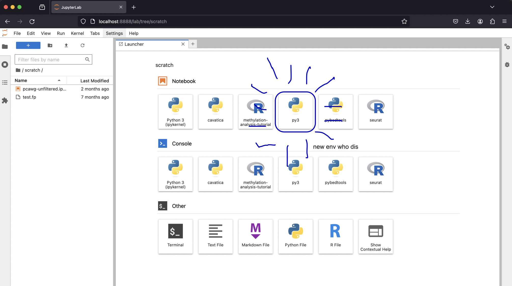

# Session 0 - Setting up your workstation with `conda`

Updated 2024-05-15

## Goal
To do bioinformatics, you need to be able to run existing software written and distributed by someone else, called *packages*. Those packages in turn 
will require other third-party packages to run, called *dependencies*, which will in turn require more dependencies, etc. You'll need to use a 
*package manager* to easily install and run external bioinformatics software. Here we set up a bioinformatics workstation using the `conda` package 
manager.

## Dependencies

This tutorial was written and tested on Mac OS 13.5 and Ubuntu 16. Similar results can be achieved using WSL (Windows). 

## Tutorial
0. Open a command line prompt.[^1] 
1. [Download](https://docs.anaconda.com/free/miniconda/index.html) and run the miniconda[^2] installer corresponding to your operating system. Accept the EULA, install in default location, and let conda modify your `.bashrc`[^3], `$PATH`, and environment variables.
   ```
   wget https://repo.anaconda.com/miniconda/Miniconda3-latest-Linux-x86_64.sh
   bash Miniconda3-latest-Linux-x86_64.sh
   ```
2. Add `conda` to `$PATH`.[^4]
   ```
   conda init
   ```
   You may now notice that your shell prompt includes the `(base)` prefix eg. `(base) ochapman@12005L4953` indicating that you are now working in your
   *base* *environment*. More on that later.
4. Add the usual bioinformatics package repositories.
   ```
   conda config --prepend channels r
   conda config --prepend channels bioconda
   conda config --prepend channels conda-forge # best practice is to have this one as top priority.
   conda config --set channel_priority strict
   ```
   [^5] 
5. We will now install our first package. The `mamba` dependency solver is an open-source improvement on base conda. 
   ```
   # Install the `mamba` dependency solver and set it to default.
   conda install --name base conda-libmamba-solver --yes
   conda config --set solver libmamba
   ```
6. The `jupyter` project is a long-running effort to provide interoperability between data science languages Python and R.[^6]
   ```
   conda install jupyter
   ```
  
   You have just set up your *base environment*, the minimal software necessary to install and run other conda packages. Best practice is to keep only 
   a minimal installation of conda here, and to create a new environment for each of your common use cases. Let's do that next.

7. My basic data analysis toolbox uses Python 3 and a few common packages:
   ```
   conda create --name py3

   # change environments by 'activating it'
   conda activate py3

   # install data analysis tools
   conda install python numpy pandas scipy statsmodels scikit-learn

   # data visualization tools
   conda install matplotlib seaborn

   # ipykernel gives the jupyter access to this environment and all packages installed here.
   conda install ipykernel
   python -m ipykernel install --user --name py3 --display-name "py3"

   conda deactivate
   ```
   While your conda environment is active, the packages installed in that environment are added to your $PATH and available for use via Python, bash, or however you normally access them.

8. You are now ready to use your new Python environment! Run
   ```
   jupyter lab
   ```
   If the installation was successful, this command will open a web browser with the `jupyter lab` interface. If you're new to jupyter, follow the
   guided tour. Stay tuned for more tutorials.
   
   
[^1]: [Mac OS] This is the Terminal app. [Windows] [Windows Subsystem for Linux (WSL)](https://learn.microsoft.com/en-us/windows/wsl/install) is your
  best friend, but mounting drives is difficult. [Linux] Bash Shell.
[^2]: `conda` is the package manager software itself. There are other flavors of essentially the same thing, with the following 
  notable differences:
    - `anaconda` is developed by Anaconda, Inc. and comes with lots of packages preinstalled. 
    - `miniconda` is a minimal installation of conda and includes only Python, conda, and a few other useful packages. This is my preferred option.
    - `miniforge` is the minimal open-source installation of conda and mamba, below. 
    - `mamba` is the open-source implementation. In the late 2010s, `conda`'s dependency solver algorithm became insufficient for the increasingly
    complex dependency trees of modern packages, so a group of freelance developers spun off `mamba`, which uses a faster algorithm but essentially
    the same syntax, except sometimes substituting eg. `mamba install` for `conda install`. The solving algorithm is now an option in `conda` which 
    we will set as default in this tutorial.
    - `micromamba` is the minimal installation of `mamba`.
[^3]: `.bashrc`, `.bash_profile` etc. are scripts that are run whenever you open a command prompt.[^7] 
[^4]: `$PATH` is where the OS looks for executable commands, so that when you type "conda init", the system knows to run the `conda` command with the 
  `init` parameter.
[^5]: `# N.B. that comments in many programming languages are denoted by '#' and everything to the right is not part of the command.`
[^6]: The Jupyter project also includes the relatively nascent programming language Julia, hence the name "ju-pyt-r".
[^7]: `.zshrc` and `.zsh_profile` on Mac OS.
